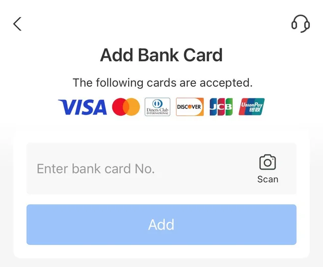
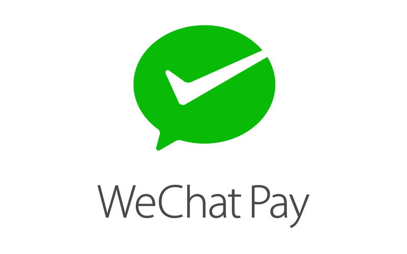
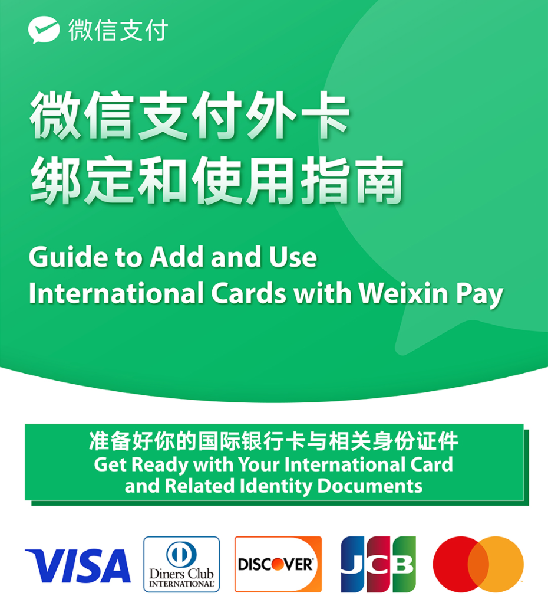

While international credit cards like Visa and Mastercard are accepted at high-end hotels and upscale restaurants in China, Alipay (支付宝) and WeChat Pay (微信支付) are generally more convenient and widely accepted for most everyday transactions.

## Setting up Alipay or WeChat Pay
The Alipay service provides a standalone mobile application known as "Alipay," which can be conveniently obtained from popular app stores like the Apple App Store and Google Play Store. In contrast, WeChat Pay is seamlessly integrated within the WeChat app, allowing users to access its features directly through the same application.

## Alipay Setup

#### Step 1: Log in Alipay vis SMS
Foreign phone numbers are supported for Alipay, as long as you can receive the SMS verification code.

#### Step 2: Complete your identity verification
Go to Account -> Setting (in the top-right corner) -> Account and Security -> Identity Information. 

Follow the instructions to complete the identity verification. You may need to provide your passport or foreign permanent resident id card.

#### Step 3: Add Credit or Debit Card

Alipay supported bank cards (both credit and debit) below:
- VISA
- MasterCard
- Diners Club INTERNATIONAL
- DISCOVER
- JCB
- UnionPay

## FAQs
**Q: What types of transactions are supported?**

**A:** Alipay supports most daily-based consumptions, but it does not support transfers or the purchase of any financing products.

**Q: What is the exchange rate?**

**A:** The exchange rate is provided by your issuing bank and card organization. You can check the actual exchange rate when making a payment.

**Q: Are there any payment limits?**

**A:** Yes, there are payment limits. For a single transaction, the maximum limit is 3000 RMB (approximately 428 USD). The monthly limit is 50000 RMB (approximately 7142 USD), and the yearly limit is 60000 RMB (approximately 857 USD).

**Q: Are there any transaction fees?**

**A:** Transactions below 200 RMB (approximately 28 USD) are fee-free. However, transactions above that amount will incur a 3% transaction fee.

## WeChat Pay Setup

#### Step 1: Download the `WeChat` app and complete sign up process. 

You can follow the [link](https://help.wechat.com/cgi-bin/micromsg-bin/oshelpcenter?opcode=2&id=120813euejvf141023eqnajz) to find more details.

#### Step 2: Go to **me** and then **wallet** to find the WeChat Pay

During the process, you will be prompted to enter your identity information for real-name authentication if you haven't already done so. Simply follow the on-screen instructions and complete the required steps as directed.

#### Step 3: Provide the identification information and add your card.

### Notes
The same rules regarding supported banks, transaction fees, and other limitations that are applicable to Alipay also apply to WeChat Pay.

If you need more info, please feel free to [contact us](mailto:info.travel2china@gmail.com).

